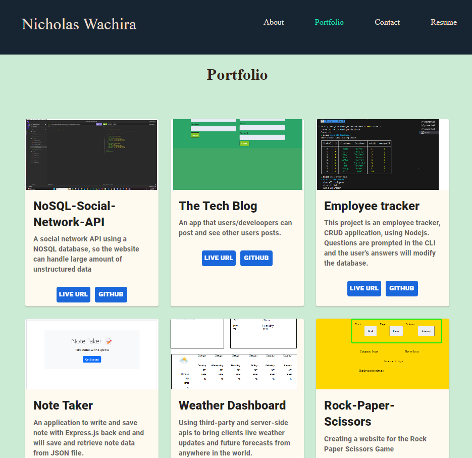
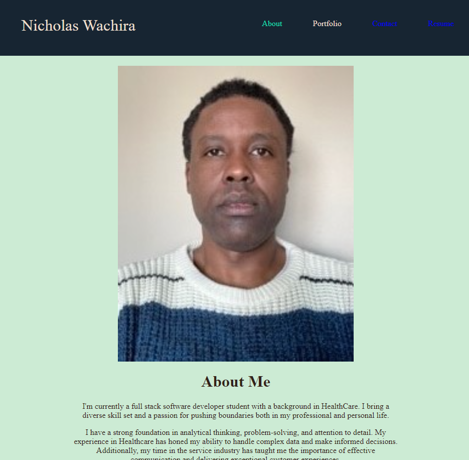
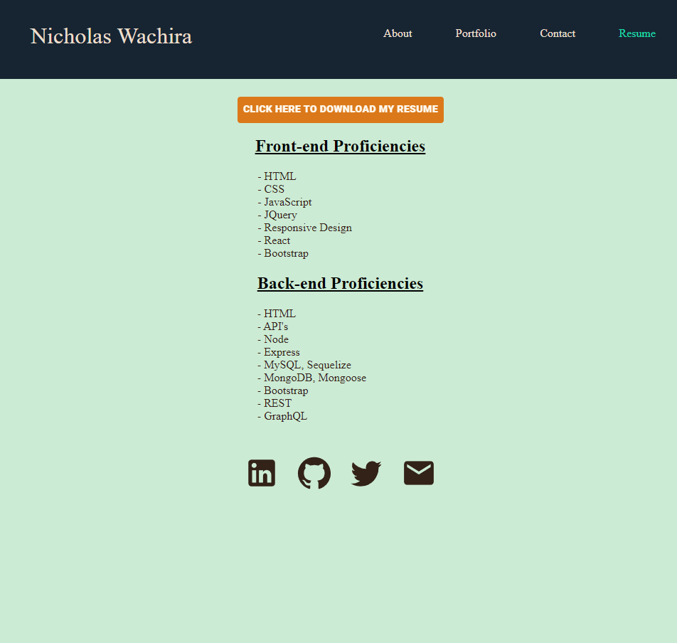

# React-Portfolio

Week-20 Challenge (React)

 

## Table of Contents

- [Description](#description)

- [Live-URL](#live-url)

- [Screenshots](#screenshots)

- [Technologies-Used](#technologies-used)

- [Installation](#installation)

- [Credits](#credits)

- [Test-Instructions](#test-instructions)

- [License](#license)

- [Questions](#questions)

## Description

This portfolio application was developed and designed to showcase my web applications, resume, and skills to potential employers, clients, and interested parties. It was created using React an open sourced JavaScript library for building user interfaces, and Material-UI, a popular component library that implements Google's Material Design. React was created by Facebook developers and helps simplify the process of building interactive and dynamic user interfaces by providing a component-based structure, efficient rendering through the virtual DOM, and a declarative syntax. It operates via a one page application, but gives the user experience of multiple page functionality.

As it stands, this application is all front-end. However I will be looking to add a backend framework so that I can receive messages via my contact page. React allows for developer flexibility and seems to still be on the rise in popularity. React offers developers numerous options in choosing other back-end frameworks and middleware options as it is a library focused on the View layer only therefore allowing developers to build UI components leaving the choice of other libraries or tools for additional functionalities open ended.

Challenges faced when building this application resulted mainly from mixing CSS and Material UI styles and implementing the useState functionality on the nav-links. Although MUI did much of the heavy lifting, tweaking already conceived styles and adding event listener functionality turned out to be more difficult than expected as the documentation and trouble shooting are not quite as readily available as a library such as Bootstrap. In addition, adding the error handling and authentication of the contact page turned out to be rather tricky as well.

## Live URL

[Link to Nicholas Wachira Portfolio]https://main--frabjous-tanuki-170112.netlify.app/
## Screenshots
![Screenshot1-week-20-challenge]

![Screenshot2-week-20-challenge]

![Screenshot3-week-20-challenge]

## Technologies Used

This application is powered by React.js (v18.2.0). Material UI (v5.13.6) and CSS were utilized to create the overall styling of the user interface.

## Installation

- To make changes to the code base, clone the repo https://github.com/Tocopro/somereact-file, run npm i within the root directory, then run npm start -> you will then be taken to a live server running the site where if edits are made to the code base they can be seen in real time.

- Users can also feel free to access the live application directly by visiting the Heroku link https://main--frabjous-tanuki-170112.netlify.app/.

## Credits

Credits are attributed to Instructor and TAs plus Github, who helped in mapping over my projects array for the portfolio page functionality.

## Features

Features of the site include Reacts ability to easily create a one page application that appears as though it is many pages. Users can easily navigate the site and view corresponding project code and websites from the portfolio page, download my most up to date resume as a PDF, and leave a mock message where error and authentication are required. Adding the backend framework and submit functionality are still a work in progress.

## Test Instructions

There is currently no unit testing written yet for this application.

## License

NOTICE: This application is covered under the MIT License

## Questions

Have additional questions? Email address.

<a href="mailto:nicwac200g@gmail.com">nicwac200g@gmail.com</a>

# Getting Started with Create React App

This project was bootstrapped with [Create React App](https://github.com/facebook/create-react-app).
